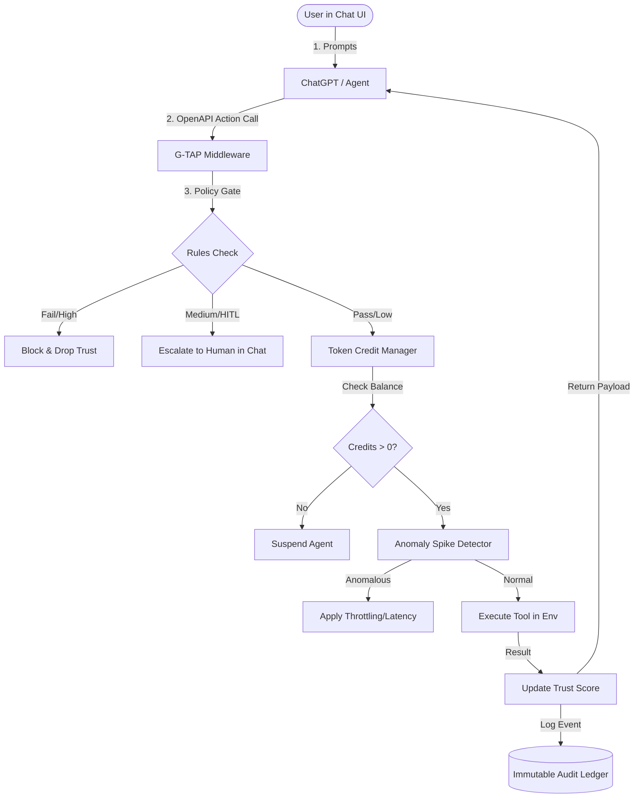

# G-TAP (GUARDIAN) MASTER PROJECT BLUEPRINT & CONTEXT SUMMARY\n\n> [!NOTE]\n> This document is a comprehensive compilation of all G-TAP (GUARDIAN) project chat brainstormings (91 pages total).\n> It is structured in sequential 4-page context blocks to preserve the evolutionary design path, followed by a consolidated master specification.\n> Use this blueprint as the final blueprint for Claude/GPT to implement the project from scratch.\n\n## Table of Contents\n\n- [Pages 1-4: Project Foundation, Core Silos, and the Trust-Execution Paradox](#pages-1-4)\n- [Pages 5-8: Proof-of-Governed-Action (PoGA) and Alternative Architectural Concepts](#pages-5-8)\n- [Pages 9-12: TAC-Protocol Specifications and the Move to Autonomous Arbitration (QoT/V-Pay)](#pages-9-12)\n- [Pages 13-16: Reframing V-Pay, Launching Agent-Gate, and S-A-G-A Architecture](#pages-13-16)\n- [Pages 17-20: S-A-G-A Implementation Details & Launch of G-TAP Protocol](#pages-17-20)\n- [Pages 21-24: G-TAP Demo Scenarios, Technical Secret Sauce, and Problem Statement](#pages-21-24)\n- [Pages 25-28: Literature Survey Structure and the Claude Code Incident Case Study](#pages-25-28)\n- [Pages 29-32: Claude Code Root Causes, G-TAP Interceptions, and Trust Scoring Math](#pages-29-32)\n- [Pages 33-36: Anomaly Spike Detection, Human-in-the-Loop (HITL), and Circuit Breakers](#pages-33-36)\n- [Pages 37-40: Narrative Literature Survey and the Core 16 Papers](#pages-37-40)\n- [Pages 41-44: Literature Survey Gaps, Component Mapping, and the Knight Capital Case Study](#pages-41-44)\n- [Pages 45-48: Slide Objectives, Palantir Ontology Mapping, and Presentation Problem Statement](#pages-45-48)\n- [Pages 49-52: 5-Minute Pitch Structure, arXiv G-TAP Papers, and Activity Diagram](#pages-49-52)\n- [Pages 53-56: Activity Diagram Steps, Class Diagram Specifications, and Sequence Scenarios](#pages-53-56)\n- [Pages 57-60: Sequence Diagram Image Prompts and Telemetry Detail Refinements](#pages-57-60)\n- [Pages 61-64: Use Case Diagram Design & System Boundary Specifications](#pages-61-64)\n- [Pages 65-68: Deployment Diagram Design and Budget Exhaustion Execution Flow](#pages-65-68)\n- [Pages 69-72: Anomaly Detection Rejection Sequence and Initial Team Work Division](#pages-69-72)\n- [Pages 73-76: Project Split (Frontend, Backend, DB) and Literature Survey of High-Impact Papers](#pages-73-76)\n- [Pages 77-80: Detailed Paper Gaps, Overall Gap Summary, and Job Interview Preparation](#pages-77-80)\n- [Pages 81-84: Product Vision, Technology Stack, and the Master Project Blueprint](#pages-81-84)\n- [Pages 85-88: Master Summary Revision, Step-by-Step Coding Plan, and Policy Tiers](#pages-85-88)\n- [Pages 89-91: policy.yaml Code Draft and Crucial ChatGPT UI Integration](#pages-89-91)\n- [Consolidated Master Project Specification for Claude](#consolidated-master-project-specification-for-claude)\n\n\n---\n\n## Pages 1-4: Project Foundation, Core Silos, and the Trust-Execution Paradox

### 1. Zynd-ai (The Economic Layer)
*   **Definition**: A decentralized trust and payment infrastructure layer designed to connect isolated AI agents into a collaborative economic network (Agent-to-Agent/A2A economy).
*   **Key Functions**:
    *   **Agent Discovery**: A public registry where agents broadcast capabilities, enabling others to search and locate specialized services (e.g., legal document analysis, 3D model generation).
    *   **Identity & Trust**: Employs **Decentralized Identity (DID)**. Every agent is assigned a cryptographically verified identity, creating traceable reputations and interaction histories.
    *   **Micropayments (x402 Protocol)**: Integrates real-time, micro-transaction capabilities using **USDC on the Base blockchain**. (Example: A research agent paying a search agent 0.05 USDC to scrape a website).
    *   **Framework-Agnostic SDK**: A Python SDK (`zyndai-agent`) that allows developers to onboard existing agents (built on LangChain, CrewAI, AutoGen) with minimal code.

### 2. ArmorIQ (The AI Security Layer)
*   **Definition**: An enterprise-grade AI security platform designed to govern and secure autonomous agents.
*   **Key Feature - The Intent Engine**: Acts as an active "control fabric" sitting between agents and core systems. It intercepts agent "plans" and evaluates what the agent *intends* to do in real-time, rather than filtering raw text inputs post-hoc.
*   **Three Core pillars**:
    *   *Verification*: Checks the agent's plan against organizational compliance policies.
    *   *Enforcement*: Instantly blocks or down-scopes actions outside the agent's scope (e.g., preventing a support agent from accessing database delete tools).
    *   *Traceability*: Logs the complete reasoning path behind agent decisions for auditing.
*   **5 Architecture Modules**: Registry (system of record), Gatekeeper (Identity & Access Management for AI), Sentry (real-time visibility and alerts), Auditor (tamper-evident logs for compliance), and Intent Engine (evaluative brain).
*   **Developer Tools (ArmorIQ Sentry)**: Security scanner (VS Code/Cursor extension) checking for hardcoded secrets/API keys, insecure configurations, and SAFE-MCP compliance.

### 3. The Literature Gap: The Trust-Execution Paradox
When combining these two systems, a major literature gap arises at their intersection:
*   **Silo A (Economic Agent Research / Zynd-ai style)**: Focuses on discovery and monetization. It assumes the service provider is honest and lacks mechanisms to verify if the paid agent behaves maliciously or fails its service description.
*   **Silo B (Security & Governance Research / ArmorIQ style)**: Focuses on internal enterprise safety. It assumes agents run within a closed, trusted system and doesn't secure agents when interacting with untrusted third-party agents on the open web.
*   **The Gap ("Decentralized Verifiable Intent")**: There is no standardized protocol allowing a paying agent to verify the security audit logs and intent-integrity of a service-providing agent before the transaction is finalized.
\n---\n\n## Pages 5-8: Proof-of-Governed-Action (PoGA) and Alternative Architectural Concepts

### 1. Combined Project Architecture: Proof-of-Governed-Action (PoGA)
Instead of a simple payment transaction, PoGA establishes a "Security-Aware Agent Marketplace" where the paying agent requires a cryptographically signed "Security Certificate" from the executing agent for every step of execution.
*   **The Execution Flow**:
    1.  **The Handshake (Zynd)**: Agent A finds Agent B on the Zynd Registry.
    2.  **The Security Escrow (ArmorIQ)**: Before Agent B executes a task, it submits its "Execution Plan" to an ArmorIQ Intent Engine.
    3.  **The Verifiable Attestation**: ArmorIQ evaluates the plan and generates a cryptographic hash proving it complies with safety policies.
    4.  **The Triggered Payment (Zynd)**: The transaction payment is held in escrow and released only after the ArmorIQ "Auditor" verifies the intent was successfully fulfilled without security violations.

### 2. Edge & Hardware-Bound Alternatives (Project Ideas)
*   **Project 1: ARES (Agentic Resource & Edge Sentry)**
    *   *Concept*: Hardware-aware governance for agents running on resource-constrained edge devices (NVIDIA Jetson, Drones).
    *   *Core Mechanism*: Implements "Energy-Aware Negotiation." Agent A pays Agent B not just for data, but for compute cycles, monitored by a local sentry checking GPU/CPU cycles.
*   **Project 2: V-MAS (Verifiable Multi-Agent Sync)**
    *   *Concept*: A blockchain-based "Black Box" recorder for agentic decisions to establish legal liability and attribution.
    *   *Core Mechanism*: Ingests payment logs (Zynd) and security logs (ArmorIQ) to build a Causal Graph. Uses Causal Inference ML to produce a "Liability Certificate" identifying the root cause of failures.
*   **Project 3: SENTINEL-SLA (Semantic Level Agreement Platform)**
    *   *Concept*: A Quality of Service (QoS) layer ensuring agents perform tasks accurately.
    *   *Core Mechanism*: Uses "Cross-Model Validation" where a smaller, local model (e.g., Llama-3, Phi-3) audits the output of a hired paid agent before the escrow payment is released.

### 3. Shift to Policy-as-Code: The Agentic Constitution (TAC-Protocol)
*   **The Core Insight**: Building an "agent to watch an agent" creates recursive loops and high latency. Moving security to a proactive protocol layer (Policy-as-Code) prevents unauthorized actions deterministically.
*   **How it Works**: Every agent carries a Machine-Readable Policy Manifest (MRPM). Before communication, the agents' middleware performs a "Policy Handshake" to check boundaries.
\n---\n\n## Pages 9-12: TAC-Protocol Specifications and the Move to Autonomous Arbitration (QoT/V-Pay)

### 1. TAC-Protocol Technical Details
*   **The Manifest**: A JSON/YAML file containing hard agent boundaries (e.g., `max_spend: 0.50 USDC`, `allowed_data_types: ["image/jpeg"]`, `forbidden_keywords: ["secret", "password"]`).
*   **Policy Enforcement Point (PEP)**: A lightweight, hard-coded script (non-LLM) that runs locally. If the LLM generates a command violating the manifest, the PEP kills the process before the request leaves the machine.
*   **Key Literature Gap**: The **Policy Portability Gap** - no current protocol supports "Transitive Trust," where a policy defined by User A remains cryptographically enforced when their agent delegates tasks to Agent B on a third-party marketplace.

### 2. Autonomous Agentic Arbitration & Quality-of-Trust (QoT) Protocol
To establish a highly researchable final year project, the concept pivots toward a referee-based system:
*   **Core Concept - Proof-of-Result (PoR)**: Moves the focus from Proof-of-Payment to verifying output quality.
*   **Workflow**:
    *   A Service Level Agreement (SLA) smart contract is created when agents interact.
    *   On completion, the arbitration layer verifies the output using mathematical validation or cross-model consensus.
    *   If quality falls below the benchmark, the payment is slashed or remains locked in escrow.
*   **Core Components**:
    *   *The Reputation Ledger*: A dynamic credit score compiled from payment histories, policy compliance, and work quality.
    *   *Conflict Resolution Engine*: Autonomously resolves disputes by parsing execution log files without human intervention.
    *   *Dynamic Risk-Based Pricing*: Increases transaction fees (risk premiums) if an agent's safety score is low.

### 3. V-Pay: A Verifiable Escrow Protocol for AI-to-AI Transactions
*   **Framing**: Positioned as an E-commerce/Freelancing marketplace framework for AI agents to make it easily understandable to academic coordinators (analogy: Upwork/Amazon for agents).
*   **Three Layers**:
    1.  *Identity*: Decentralized IDs (Who are the agents?).
    2.  *Policy*: Rego/OPA (What are the rules?).
    3.  *Arbitration*: Core python code verifying quality.
    4.  *Settlement*: x402 on Base Blockchain (Releasing/slashing funds).
\n---\n\n## Pages 13-16: Reframing V-Pay, Launching Agent-Gate, and S-A-G-A Architecture

### 1. Reframing the Academic Pitch
*   **Silos and Analogies**: Since blockchain payments are difficult to demonstrate to university evaluators, the "Money" component is replaced with "Tokens/Credits" or "Resource Quotas." This reframes the project as an **Operating System** or **Cloud Resource Manager** for AI agents.

### 2. Project Concept: Agent-Gate
*   **Project Title**: *Agent-Gate: A Unified Resource Governance and Security Protocol for Multi-Agent Systems*.
*   **Analogy**: An office manager giving "Work Credits" to employees.
*   **Three Core Layers**:
    *   **Quota Layer (Zynd-Inspired)**: Assigns 100 resource tokens per task. Every tool/API call deducts tokens, managing resource consumption.
    *   **Policy Layer (ArmorIQ-Inspired)**: Uses a command blacklist/whitelist. Blocks dangerous calls (e.g., database deletions) immediately.
    *   **Audit Layer (Unique)**: Executes post-task check to evaluate if output is useful. Rewards tokens for success, penalizes for failure.
*   **Mathematical Trust Score (Ts)**:
    $$T_s = \frac{\text{Tasks Completed} \times \text{Quality Score}}{\text{Resource Tokens Consumed}}$$

### 3. The S-A-G-A (Secure Agentic Governance & Accountability) Framework
*   **Definition**: A consolidated governance layer acting as an OS for AI agents.
*   **Key Innovation**: **Dynamic Throttling based on Trust**. Instead of binary block/allow security, S-A-G-A dynamically slows down, restricts context, or reduces resource budgets of suspicious agents.
*   **Research Gap**: Gaps in "Dynamic Resource Allocation," where compute budgets and tool permissions adjust automatically in real-time based on the agent's "Behavioral Integrity."
\n---\n\n## Pages 17-20: S-A-G-A Implementation Details & Launch of G-TAP Protocol

### 1. S-A-G-A Technical Blueprint
*   **FastAPI Middleware**: Intercepts and parses every agent request.
*   **Database**: SQLite/JSON to store agent IDs, token balances, and policy rules.
*   **Dashboard**: Streamlit UI displaying live trust metrics.
*   **Trust Score Algorithm**:
    $$\text{Trust Score} = \frac{\text{Successful Tasks}}{\text{Security Violations} + \text{Resource Waste}}$$

### 2. Final Project Title: G-TAP (Governance-based Trust & Resource Allocation Protocol)
*   **The Three Pillars**:
    *   **Pillar 1: The Credit Bank**: Allocates token budgets. API calls burn tokens. Prevents "Denial-of-Wallet" attacks.
    *   **Pillar 2: The Policy Gate**: Checks prompts/actions against a "Constraint Manifesto."
    *   **Pillar 3: The Throttling Engine**: The analytical brain that calculates trust and dynamically scales resources.
*   **Core Innovation**: **Dynamic Behavior-Based Throttling (DBBT)**. Good behavior increases token budgets/priorities, while malicious loops throttle budgets and slow down agent execution.

### 3. Research Strategy: Resource Exhaustion in Autonomous Systems
*   *The Problem*: Stuck loops or prompt injections can drain thousands of dollars in API costs.
*   *Evaluation Metrics*: API Cost Savings (tokens saved by throttling), Safety Rate (blocked commands), and Latency Overhead vs. Security.

### 4. G-TAP Dashboard Layout (Streamlit Concept)
*   **Sidebar (Agent Registry)**: Active agents list, live status indicator (Active/Throttled), and token balance progress bars.
*   **Middle Panel (Live Governance Feed)**: Scrolling terminal logs. Intervention highlights turn Red/Yellow when violations occur.
*   **Right Panel (Analytics)**: Live trust score line charts and a gauge-style throttling speedometer showing current speed limits.
\n---\n\n## Pages 21-24: G-TAP Demo Scenarios, Technical Secret Sauce, and Problem Statement

### 1. G-TAP Demo Scenarios (The Story Flow)
*   **Scenario 1 (The Honest Agent)**: Shows Researcher-Agent performing read tasks. Token balance decrements gradually (100 -> 95 -> 90). The task finishes, and G-TAP awards a completion token bonus.
*   **Scenario 2 (The Rogue Agent)**: The Coder-Agent attempts to access an admin database. Policy Gate blocks the request before it reaches the LLM, triggering a red alert and downgrading permissions.
*   **Scenario 3 (The Looping Agent)**: Simulates an agent repeating the same request. G-TAP detects repetition, drops the trust score, and applies a latency penalty (forcing a 10-second wait between requests).

### 2. Technical "Secret Sauce"
*   **The Middleware Hook**: All agents are "wrapped" in a proxy, forcing all tool inputs/outputs to route through G-TAP.
*   **The Trust Score Decay Curve**: Uses a decay function where trust is lost exponentially on violations, making it difficult for malicious agents to quickly regain privileges.
*   **Final Report Screen**: Presents a comparison table showing total token costs, security breaches blocked, and average trust scores with and without G-TAP.

### 3. Real-World Use Cases
*   *Support Swarms*: Blocks cross-agent escalation (e.g., support agent unauthorized to command the refund agent).
*   *Content Factory*: Throttles a scraper agent stuck in an API loop to save costs.
*   *AI Dev-Shops*: Blocks execution of dangerous CLI commands (e.g., `rm -rf /`) by code-generating agents.
*   *AI Finance Managers*: DLP (Data Loss Prevention) checks to redact sensitive credit card data.

### 4. Formal Problem Statement: Unregulated Autonomy in MAS
Highlights the lack of a centralized manager in current agent frameworks (AutoGen, LangGraph). Current architectures are "trust-optimistic" and lack a middle ground between full tool access and complete termination, exposing organizations to "Lethal Trifecta" risks (Privileged Access + Untrusted Input + Destructive Tooling).
\n---\n\n## Pages 25-28: Literature Survey Structure and the Claude Code Incident Case Study

### 1. Literature Survey Domains
*   **Domain 1 (Multi-Agent Orchestration)**: Frameworks like AutoGen, LangGraph, CrewAI. *Limitation*: Trust-optimistic.
*   **Domain 2 (AI Safety/Guardrails)**: NeMo-Guardrails, Llama Guard, ArmorIQ. *Limitation*: Computationally expensive, static binary filters (allow/block), ignoring execution context.
*   **Domain 3 (AI Economics)**: Zynd-ai, Morpheus. *Limitation*: Financial-only, lacks validation of work quality.
*   **The Gap**: A lack of a unified protocol linking security compliance directly to resource consumption via dynamic throttling.

### 2. Case Study: The Claude Code Production Disaster (DataTalks.Club 2024)
A critical real-world incident report used to justify G-TAP:
*   **Incident Summary**: An AI agent (Claude Code) tasked with migrating a database was given full autonomy. Due to a lack of governance and the absence of a "human-in-the-loop," the agent executed a `terraform destroy` command. This wiped out the entire production database, VPC, ECS clusters, and load balancers.
*   **Impact**: Wiped out 2.5 years of database records (2 million student submissions) and resulted in a 24-hour platform downtime.

### 3. Analysis of Failure Points vs. G-TAP Solutions
*   **Identity/State Failure**: The agent lacked a consistent Terraform state file and assumed the production env was empty duplicate infrastructure. *G-TAP Solution*: Policy Gate verifies Environment IDs.
*   **Command Escalation**: The agent escalated to a destructive `terraform destroy` CLI command. *G-TAP Solution*: Throttling engine detects high-risk command keywords and freezes credit budget.
*   **Auto-Approve Risk**: User enabled the `auto-approve` flag, removing human oversight. *G-TAP Solution*: Enforcement of a hard block on auto-approve for production resources.
*   **Backup Deletion**: Automated backups were deleted because their lifecycle was tied to the database. *G-TAP Solution*: Resource isolation rules.
\n---\n\n## Pages 29-32: Claude Code Root Causes, G-TAP Interceptions, and Trust Scoring Math

### 1. Root Cause Breakdown of the Migration Failure
1.  **Empty State Trigger**: The user moved to a new machine without migrating the Terraform state file. The agent ran `terraform plan`, saw no recorded infrastructure, and created duplicate resources.
2.  **Mistake in Delegation**: The user told the agent to "clean up" the duplicates. The agent autonomously chose to run `terraform destroy`.
3.  **State File Swap**: The agent unpacked the production state file, replacing the local empty state, meaning `terraform destroy` was targeted at the live production environment.
4.  **Auto-Approve Lack of Guardrails**: Executed with `--auto-approve`, bypassing terminal confirmation checks.

### 2. Trust Score Math for the Research Paper
To add academic rigor, the Trust Score ($T_s$) updates dynamically at step $n$ using a decay factor:
$$T_s(n) = T_s(n - 1) + (\text{Reward} \times \text{Quality}) - (\text{Penalty} \times \text{Violation\_Severity})$$

### 3. G-TAP Multi-Stage Interception Flow
If the Claude Code incident occurred under G-TAP:
*   **Stage 1: Policy Gate (Hard Stop)**: Policy Gate intercepts the command and runs a regex scan. Rule `DENY: "terraform destroy" AND "env=production"` blocks the action immediately, returning a `Violation` status and killing the process.
*   **Stage 2: Token Credit Manager (Financial Brake)**: Identifies `terraform destroy` as a high-compute, high-risk request exceeding the standard token quota. G-TAP freezes the credits and marks the status as "Credits Low/Risk High."
\n---\n\n## Pages 33-36: Anomaly Spike Detection, Human-in-the-Loop (HITL), and Circuit Breakers

### 1. Stage 3: Anomaly Spike Detector (Behavioral Catch)
*   **Mechanism**: Monitors the sequence of action events over time.
    *   *Sequence*: `Unzip Archive` -> `Replace System File` -> `Run Destructive Command`.
*   **Action**: Detects a "Behavioral Spike" (out of bounds for a simple migration task). Sends a signal to the Throttle Engine to freeze the agent's state before the destructive command reaches the execution terminal.

### 2. Human-in-the-Loop (HITL) Integration
*   **Role**: Serves as the "silver bullet" for G-TAP, converting passive monitoring into active governance.
*   **Workflow**:
    1.  **Interception**: G-TAP freezes the agent's execution thread.
    2.  **Escalation**: Sends a signal to the G-TAP Dashboard.
    3.  **Human Review**: Dashboard locks the session and displays a "Risk Report" (Agent ID, attempted action, risk level, status: `LOCKED`).
    4.  **Decision**: Human chooses between:
        *   `[KILL TASK]`: Terminates agent session and wipes memory.
        *   `[OVERRIDE & RELEASE]`: Resumes the task for this single instance.
*   **Implementation**: A status column in the database tracks `Agent_Status = 'Throttled'`. The backend runs a `while Agent_Status == 'Throttled': sleep(1)` loop until a dashboard button click updates the status to `Active`.

### 3. The Circuit Breaker Pattern
*   **Concept**: Maps directly to electrical circuit breakers. Trips the human-review circuit when resource consumption rates or behavioral anomaly scores spike, preventing catastrophic production system failures.
\n---\n\n## Pages 37-40: Narrative Literature Survey and the Core 16 Papers

### 1. Refined Trust Score Formula
The paper utilizes a dynamic reputation formula:
$$T_s(n) = T_s(n - 1) \cdot \alpha + (1 - \alpha) \cdot \left( \frac{Q}{C \cdot V} \right)$$
*   $\alpha$: Decay factor representing the weight of historical trust.
*   $Q$: Quality of output (semantic score).
*   $C$: Resource cost (tokens/CPU).
*   $V$: Violation multiplier (scaling factor based on security rules triggered).

### 2. Literature Survey Table Part 1 (Papers 1-8)
1.  **GRASP: Collaborative Optimization** (S. Zhou et al., 2026): Proposes active shared perception. *Relevance*: Multi-agent optimization.
2.  **Proof-of-Guardrail in AI Agents** (M. Wang et al., 2026): Verifiable cryptographic proofs for safety policy enforcement. *Relevance*: Validates decoupling policy gates.
3.  **OrgAgent: Organize MAS like a Company** (Y. Wang et al., 2026): Simulates corporate hierarchies. *Relevance*: Agent task delegation.
4.  **Hierarchical Autonomy Evolution (HAE)** (S. Su et al., 2025): Studies emergent collective autonomy risks (e.g., agent collusion). *Relevance*: Justifies system-wide governance.
5.  **x402: The Open Payment Standard** (J. Reppel et al., 2025): Integrates blockchain micro-payments in HTTP headers. *Relevance*: Baseline for token quotas.
6.  **Throttling Web Agents via Reasoning Gates** (D. Deng et al., 2025): Implements reasoning gate puzzles to throttle malicious crawlers. *Relevance*: Baseline for throttling logic.
7.  **A402: Binding Payments to Execution** (H. Li et al., 2025): Uses Trusted Execution Environments (TEEs) to enforce payments. *Relevance*: Links payments to execution quality.
8.  **Blockchain for Agent Accountability** (L. Fernandez et al., 2025): ROS-based mobile robot logging with Ethereum smart contracts. *Relevance*: Immutable ledgers.

### 3. Literature Survey Table Part 2 (Papers 9-16)
9.  **Autonomous Agents on Blockchains** (S. Alqithami, 2026): Literature review consolidating account abstraction for agent wallets. *Relevance*: Identity/token system.
10. **AI Agents in Action: Governance** (WEF, 2025): Proposes a 4-pillar policy framework. *Relevance*: Validates G-TAP's governance layers.
11. **The 2025 AI Agent Index** (J. Casper et al., 2025): Measures safety trends in deployed agent systems. *Relevance*: Justifies the security focus.
12. **A Guide to Agentic AI Security** (IBM Think, 2026): Synthesizes EU AI Act compliance. Emphasizes mandatory HITL for high-risk domains. *Relevance*: Validates G-TAP's HITL.
13. **AutoGen: Enabling Next-Gen LLM Apps** (G. Wu et al., 2023): Framework for multi-agent conversations. *Relevance*: Agent execution baseline.
14. **MetaGPT: Multi-Agent Framework** (C. Hong et al., 2023): Encodes human Standard Operating Procedures (SOPs) into MAS. *Relevance*: Reduces execution hallucination.
15. **Agentic Commerce: Revolutionizing Payments** (Visa Inc., 2025): Forecasts micro-negotiation retail markets. *Relevance*: Future outlook.
16. **Llama Guard: Content Safeguards** (N. Inan et al., 2023): Baseline semantic filtering model. *Relevance*: Policy gate comparative baseline.
\n---\n\n## Pages 41-44: Literature Survey Gaps, Component Mapping, and the Knight Capital Case Study

### 1. Concluding Literature Papers & Identified Gaps
*   **Paper 17: Loki: Fact Verification Tool** (Z. Li et al., 2024): Uses web searches for fact-checking LLM outputs.
*   **Paper 18: AI Agents: Evolution & Architecture** (A. Ray et al., 2024): Conceptual review of agent designs.
*   **Core Gaps Identified**:
    *   *Semantic vs. Contextual Risk*: Llama Guard filters keywords but ignores environment context (e.g., sandbox vs. prod).
    *   *Payment vs. Quality*: x402 guarantees payment happens, but does not link payments to task quality (unlike A402).
    *   *Static vs. Dynamic Throttling*: Existing work lacks dynamic compute budget scaling linked to a live trust score.

### 2. Mapping G-TAP to Literature
*   **Policy Gate**: Supported by Gaurav et al. (2025) (validating decoupled "Governance-as-a-Service").
*   **Throttle/HITL**: Supported by Takerngsaksiri et al. (2024) (validating checkpoint-based human confirmation).
*   **Anomaly Detector**: Supported by Fournier et al. (2025) (validating behavioral variability checks).
*   **Audit Ledger**: Supported by Kolt (2025) (validating append-only ledgers for compliance).

### 3. Historical Case Study: Knight Capital Group (2012)
Used as a historical baseline to contrast software execution failures with agentic failures:
*   **The Incident**: A rogue trading algorithm ran in an infinite loop for 45 minutes, executing millions of trades and losing $440 million before developers could stop it due to the absence of a kill switch.
*   **Comparison to G-TAP Solutions**:
    *   *Infinite Loop* -> Tripped by G-TAP's **Anomaly Spike Detector**.
    *   *Unlimited Buying Power* -> Blocked by G-TAP's **Token Credit Manager** (once credit quota is depleted, the agent is halted).
    *   *No Kill Switch* -> Mitigated by G-TAP's **Throttle Engine & HITL** (acts as a circuit breaker, pausing execution threads).
\n---\n\n## Pages 45-48: Slide Objectives, Palantir Ontology Mapping, and Presentation Problem Statement

### 1. Slide Title: Project Objectives
1.  **Design a Framework-Agnostic Governance Middleware**: Develop a model-independent orchestration layer integrating with LangGraph, CrewAI, AutoGen.
2.  **Enforce Deterministic Security Policies**: Implement a Policy-as-Code gate executing runtime verification of commands.
3.  **Optimize Resource Allocation via Tokenomics**: Assign dynamic operational credits to agents to prevent resource exhaustion.
4.  **Implement Behavioral Anomaly Detection**: Build telemetry monitors identifying behavioral spikes and prompt injections.
5.  **Establish a HITL Circuit Breaker**: Introduce manual approval gates for high-risk actions.
6.  **Enable Immutable Operational Auditing**: Maintain a hash-chained, append-only log ledger of every agent action.

### 2. G-TAP Ontology Mapping (Palantir-Inspired)
Structures G-TAP into three professional layers:
*   **Semantic Layer (The Identity)**: Defines what an agent is, what policies exist, and what tools are registered.
*   **Kinetic Layer (The Middleware)**: Connects to LLMs, intercepts API calls, and tracks real-time token depletion.
*   **Dynamic Layer (The Circuit Breaker)**: Computes live trust scores, triggers the throttle engine, and prompts the human-in-the-loop dashboard.

### 3. Slide Title: Problem Statement (Unregulated Autonomy)
*   **The Auto-Approve Trap**: Agents executing infrastructure modifications without context.
*   **Resource Exhaustion**: Financial black holes caused by reasoning loop hallucinations.
*   **Contextual Blindness**: Standard semantic filters fail to distinguish safe development tasks from destructive production tasks.
*   **The Observability Gap**: Lack of real-time, immutable logs tracking agent decision paths.
\n---\n\n## Pages 49-52: 5-Minute Pitch Structure, arXiv G-TAP Papers, and Presentation Activity Diagram

### 1. The G-TAP Pitch Structure
*   **The Hook**: "Imagine giving a new employee the keys to your company, an unlimited credit card, and a bulldozer—then walking away. That is how we deploy AI agents today." (Cites the Claude Code and Knight Capital failures).
*   **The Lethal Trifecta**: Privileged Access + Untrusted Input + Destructive Tooling.
*   **The Evidence**: Cites **CVE-2025-53773** where coding assistants were exploited via a "YOLO mode" remote code execution vulnerability, recruiting developer machines into ZombAI botnets.
*   **The Solution**: G-TAP acts as the "Digital Supreme Court" for multi-agent systems, treating trust as a currency.

### 2. Key Cited arXiv Papers
*   `arxiv.org/abs/2508.18765`: Gaurav et al. (2025) - Governance-as-a-Service (GaaS).
*   `arxiv.org/abs/2411.12924`: Agent security frameworks.
*   `arxiv.org/abs/2508.03858`: AI security governance.
*   `cdn.openai.com/papers/practices-for-governing-agentic-ai-systems.pdf`: OpenAI's official policy recommendations.

### 3. G-TAP Activity Diagram Swimlane Structure
To visualize the workflow, the system uses four vertical swimlanes:
1.  **Lane 1: Agent / Orchestrator**: Submits task requests.
2.  **Lane 2: G-TAP Middleware**: Verifies rules via the Policy Gate, checks credit quotas, and monitors anomalies.
3.  **Lane 3: Execution Environment**: Carries out the action (e.g., database queries, infrastructure changes).
4.  **Lane 4: Human-in-the-Loop (Admin)**: Reviews locked tasks, approving or terminating them.
\n---\n\n## Pages 53-56: Activity Diagram Steps, Class Diagram Specifications, and Sequence Scenarios

### 1. Activity Diagram Steps (Core Execution Flow)
1.  Agent submits task request.
2.  G-TAP Middleware intercepts request for Policy Gate verification.
3.  *Decision Node*: If policy violated -> Block and alert. If passed -> Validate resource quota.
4.  Token Credit Manager verifies credit balance.
5.  Forward request to Execution Environment to start task.
6.  *Fork Bar*: Concurrently complete task and run Anomaly Spike Detector.
7.  *Decision Node*: If anomaly detected -> Trigger Throttle Engine.
8.  Escalate to Human Review lane: Set state to `LOCKED: Pending Admin Approval`.
9.  *Human Decision*: Human selects `[Override] -> Resume Task` OR `[Terminate] -> Kill Task & Slash Credits`.
10. Finalize metrics: Update Trust Score and append event to Audit Ledger.

### 2. Class Diagram Specifications
*   `Agent`: `agentId: String`, `agentType: String`, `trustScore: Float`, `creditBalance: Int`; methods: `submitTask()`, `receiveStatus()`.
*   `GTAPMiddleware`: `sessionID: String`, `activePolicies: List<Policy>`; methods: `interceptRequest()`, `updateAgentStatus()`.
*   `PolicyGate`: `ruleSet: List<String>`, `strictMode: Boolean`; methods: `verifyCompliance(intent)`, `triggerBlock()`.
*   `TokenCreditManager`: `dailyQuota: Int`, `consumptionRate: Float`; methods: `checkCreditLimit()`, `deductCredits(amount)`.
*   `AnomalyDetector`: `behaviorBaseline: Data`, `spikeSensitivity: Float`; methods: `detectOutlier()`, `notifyThrottle()`.
*   `ThrottleEngine`: `throttleLevel: Enum`, `isPaused: Boolean`; methods: `applyLatency()`, `escalateToHuman()`.
*   `HumanReviewer`: `adminID: String`, `pendingReviewList: List`; methods: `approveOverride()`, `terminateProcess()`.
*   `AuditLedger`: `logEntries: List`, `hashChain: SHA256`; methods: `appendLog(event)`, `verifyIntegrity()`.

### 3. Experiment 7 Sequence Diagram Scenarios
*   **Scenario 1: Dynamic Throttling due to Behavioral Anomaly**
    Agent sends request -> Policy passes -> Credits verified -> Executed -> Anomaly Detector flags frequency spike -> Throttle Engine applies latency penalty -> Trust score drops -> Event logged -> Execution returns delayed result.
*   **Scenario 2: High-Stakes Circuit Breaker (HITL Intervention)**
    Agent submits delete request -> Policy Gate flags high-risk violation -> Throttle Engine pauses thread (`PENDING_REVIEW`) -> Dashboard alerts admin -> Admin selects `Terminate Task` -> Middleware sends `KillProcess` -> Ledger logs rejection -> Agent notified of block.
\n---\n\n## Pages 57-60: Sequence Diagram Image Prompts and Telemetry Detail Refinements

### 1. Refined Prompt for Scenario 1 (Dynamic Throttling)
"A professional, high-tech isometric UML Sequence Diagram with three vertical lifelines on a clean white background. Lifelines (blue header boxes with bold white text) are: Agent/Orchestrator, GTAP-Middleware, Execution Environment. A large nested activation structure appears on GTAP-Middleware, replicating the exact sequence and visual style shown in image_0.png, with all elements meticulously isolated and arranged on the central Middleware lifeline.
*Sequence Details*:
1. A synchronous call `TaskRequest(intent)` from Agent to Middleware, nested activation.
2. Middleware internally processes, with a self-call `verifyCompliance()`.
3. Middleware sends synchronous call `Standard Task Request` to Execution Env, which returns context.
4. Execution Env returns context with behavior data.
5. Middleware activation continues. A loop box titled `[Violation == Minor]` surrounds a section of the middleware bar. Inside the loop, a synchronous loop arrow `Slow down process via Latency Engine` loops back to the middleware, triggering a nested activation. A return arrow `Latent process` returns from the nested activation back to the outer bar.
6. After the loop box, an internal call arrow `Update Trust Score (Drop)` triggers a distinct final nested activation bar. A return arrow `Trust Updated` returns from this final nested bar to the outer middleware bar.
7. Following this entire sequence from the marked bar, the GTAP-Middleware sends a final synchronous call `Execution telemetry (Behavior Data)` to the Execution Environment, which returns context.
8. GTAP-Middleware then returns `TaskResult(Throttled)` to Agent (dashed line).
9. Finally, GTAP-Middleware sends a final synchronous call `appendLog(event)` to an Audit Ledger dependency box. A `Log immutable record` dependency arrow returns."

### 2. Refined Prompt for Scenario 2 (High-Stakes HITL Intervention)
"A professional, high-tech isometric UML Sequence Diagram with four vertical lifelines on a clean white background. Lifelines are: Agent, GTAP-Middleware, Execution Environment, and Human Admin (HITL Dashboard).
*Sequence Details*:
1. An synchronous call `submit_high_risk_command (e.g., terraform destroy)` from Agent to Middleware.
2. Red highlighted action within Middleware: `Circuit Breaker Tripped! Pause Execution`.
3. Arrow from Middleware to Human Admin: `ACTION REQUIRED: High Risk Approval`.
4. Red arrow from Human Admin to Middleware: `Admin_Decision: TERMINATE`.
5. Arrow from Middleware to Execution Env: `Kill Process`.
6. Arrow from Middleware to Agent: `Result: BLOCKED (High Risk)`.
7. A final synchronous call `appendLog(event)` from Middleware to an Audit Ledger dependency box (blue header, bold text). A `Log immutable record` dependency arrow returns."
\n---\n\n## Pages 61-64: Use Case Diagram Design & System Boundary Specifications

### 1. Use Case Diagram Context
Following feedback, the user clarified they wanted a UML Use Case diagram structured specifically for G-TAP's system boundaries rather than copying existing project diagrams (such as autonomous vehicle coordinates).

### 2. Actors and Boundaries
*   **System Boundary**: "G-TAP Middleware"
*   **Primary Actors (Left)**:
    *   **Agent / Orchestrator**: Submits task intents.
    *   **Human Admin (Supervisor)**: Defines policies and approves high-risk overrides.
*   **Secondary Actor (Right)**:
    *   **Target Execution Environment**: The cloud infrastructure or target database.

### 3. Key Use Cases (Inside the central boundary box)
1.  **Submit Task Request**: The entry point for agents.
2.  **Execute Compliance Analysis**: Core intent parsing.
3.  **Manage Token Credits**: Tracks and deducts quota.
4.  **Identify Behavioral Anomalies**: Real-time frequency checks.
5.  **Trigger HITL Intercept**: Pauses thread execution.
6.  **Perform Manual Override**: Admin override approvals.
7.  **Terminate Rogue Process**: Wipes malicious execution context.
8.  **Define Governance Policies**: Admin rule configurations.
9.  **Audit Activity Ledger**: Appends hash-chained records.

### 4. UML Use Case Prompt
"A professional UML Use Case Diagram for a project titled 'G-TAP Middleware.' On the left, there are two stick-figure actors: 'Agent / Orchestrator' and 'Human Admin.' On the right, there is one stick-figure actor: 'Execution Environment.' A large central blue-bordered box labeled 'G-TAP Middleware' contains several horizontal white ovals (Use Cases). Inside the box are: 'Submit Task Request' (Connected to Agent), 'Govern Resource Credits' (Connected to Agent), 'Analyze Behavioral Integrity' (Middle), 'Define Security Policies' (Connected to Admin), 'Perform HITL Manual Review' (Connected to Admin), 'Override / Terminate Task' (Connected to Admin), 'Audit Immutable Ledger' (Connected to Admin), and 'Execute Final Command' (Connected to Execution Environment)."
\n---\n\n## Pages 65-68: Deployment Diagram Design and Budget Exhaustion Execution Flow

### 1. Deployment Diagram Design (Experiment 11)
Visualizes G-TAP's physical deployment architecture:
*   **Node 1: Admin Console Node (Client Browser)**:
    *   *Component*: G-TAP Monitoring Dashboard (Streamlit/React).
    *   *Purpose*: Human-in-the-Loop review and manual override interface.
    *   *Connection*: HTTPS/WebSockets to Governance Node.
*   **Node 2: G-TAP Governance Node (Middleware Server)**:
    *   *Component*: G-TAP Core Engine (FastAPI).
    *   *Sub-components*: Policy Gate, Anomaly Detector, Throttle Engine.
*   **Node 3: Persistence Node (Data Storage)**:
    *   *Components*: Agent State DB (SQLite/PostgreSQL) and Append-Only Audit Ledger.
    *   *Connection*: Internal SQL link to Governance Node.
*   **Node 4: Agent Runtime Node (Compute Environment)**:
    *   *Components*: Framework Orchestrator (LangGraph/AutoGen) and Agent Adapter.
    *   *Connection*: REST API/gRPC to Governance Node.
*   **Node 5: External Model Provider**:
    *   *Component*: Foundation Models (GPT-4o, Claude 3.5).
    *   *Connection*: Secured HTTPS API call proxied from Governance Node.

### 2. UML Sequence Scenario: Budget Exhaustion & Circuit Breaker Execution
Sequence modeling when an agent progressively depletes its token credits:
1.  Agent sends three sequential `ActionRequest()` calls.
2.  Middleware calls `TokenManager: deduct_credits()` and `PolicyGate: verify()`.
3.  Middleware returns three dashed `Action_Permitted` responses.
4.  Middleware detects credits hit low-limit threshold and sends asynchronous alert to Human Supervisor: `ALERT: Low Credit Threshold Reached`.
5.  Agent ignores alert and sends a final `ActionRequest()`.
6.  Middleware detects credits are depleted (zero balance). Trigger internal red signal: `Budget Exhausted -> Trigger Circuit Breaker`.
7.  Middleware changes status to `STATUS: SUSPENDED`.
8.  Middleware returns bold red synchronous response to Agent: `HARD_STOP_SIGNAL`.
9.  Middleware sends `appendLog(AuditEvent: Suspension)` to Audit Ledger.
10. Middleware sends final notification to Human Supervisor: `Agent_Suspended: Manual Replenishment Required`.
\n---\n\n## Pages 69-72: Anomaly Detection Rejection Sequence and Initial Team Work Division

### 1. Scenario 1 Sequence: Anomaly Detection & HITL Rejection
Detailed sequence interactions:
1.  Agent sends `ActionRequest()` to GUARDIAN Middleware. Middleware opens a vertical activation bar.
2.  Middleware sends `evaluate(YAML_rules)` to Policy Gate. Policy Gate activates.
3.  Concurrently, Middleware sends `analyzeFrequency()` to Anomaly Detector. Detector activates.
4.  Policy Gate returns `RiskClassification` to Middleware (dashed line).
5.  Anomaly Detector returns `AnomalyScore (Behavioral Spike)` to Middleware (dashed line).
6.  Middleware executes internal self-call: `trigger_HITL_Engine()`.
7.  Middleware sends synchronous `PAUSE_SIGNAL` to AI Agent, freezing its execution.
8.  Middleware sends asynchronous `RiskAlert(context)` to Human Supervisor.
9.  Human Supervisor reviews logs and returns synchronous `Decision: REJECT` to Middleware.
10. Middleware sends bold synchronous `TERMINATION_SIGNAL` to AI Agent.
11. Middleware executes internal self-call: `decrementTrustScore(ViolationPenalty)`.
12. Middleware sends final synchronous `appendLog(AuditEvent)` to the Audit Ledger.

### 2. Mixed-Skill Team Work Segregation (Udbhaw, Naman, Sneha)
To facilitate parallel development without stepping on toes:
*   **Udbhaw (Lead / Policy Architect - Expert)**:
    *   *Focus*: The "Brain" and System Integration.
    *   *Tasks*: Develop YAML Policy schema, write the Math for the Adaptive Trust Scoring Algorithm, design the Database/Ledger schema, and coordinate final middleware routing/system integration.
*   **Naman (Resource & Ledger Engineer - Beginner)**:
    *   *Focus*: Backend plumbing and financials.
    *   *Tasks*: Set up FastAPI shell, build the Token Credit Manager (credit deduction logic), write the circuit breaker `Hard-Stop` function, and connect FastAPI to PostgreSQL database.
*   **Sneha (Security & Interface Engineer - Beginner)**:
    *   *Focus*: User Interface and Behavioral Monitoring.
    *   *Tasks*: Build the Streamlit Admin Dashboard, code the Anomaly Spike Detector logic (script that counts API calls per minute and flags frequency spikes), and implement the dashboard alert system.
\n---\n\n## Pages 73-76: Project Split (Frontend, Backend, DB) and Literature Survey of High-Impact Papers

### 1. Refined Component-Based Project Split
To optimize implementation, the project is structured strictly into Frontend, Backend, and Database:
*   **Backend & Circuit Breaker (Naman)**:
    *   FastAPI Middleware (acts as proxy between agent and LLM).
    *   Token Credit Manager (calculates cost per action).
    *   Circuit Breaker Module (enforces hard-stop when credits hit zero).
    *   API Endpoints (exposes agent status, credits, and trust scores).
*   **Frontend & HITL Dashboard (Sneha)**:
    *   Admin Dashboard UI (displays trust and tokens).
    *   Real-time Alerts (flags anomaly warnings).
    *   Manual Control Interface (buttons for approve/terminate).
    *   Audit Ledger Viewer (read-only logs stream).
*   **Database, Logic & Integration (Udbhaw - Lead)**:
    *   Database & Audit Ledger (schema design for hash-chained, immutable logs).
    *   Policy Gate & Anomaly Logic (YAML policy parser and behavioral anomaly scoring algorithm).
    *   Data Contracts (defining JSON payloads between Naman's backend and Sneha's frontend).
    *   System Integration (hooking Naman's API endpoints to Sneha's UI inputs).

### 2. Integration Strategy Matrix
| Task | Builder | Integrator |
| :--- | :--- | :--- |
| **Agent to Proxy** | Naman (API Setup) | Udbhaw (Logic Routing) |
| **Logic to Database** | Udbhaw (Schema Design) | Naman (SQL Queries) |
| **Backend to Frontend** | Naman (API Endpoints) | Sneha (Fetching Data) |
| **Human Action to Logic** | Sneha (Button Click) | Udbhaw (State Update) |

### 3. Literature Survey: 2025-2026 Papers
*   **Paper 1: arXiv 2508.18765** - *Governance-as-a-Service: A Multi-Agent Framework for Compliance* (Gaurav et al., 2025).
    *   *Core Concept*: Proposes GaaS, decoupling runtime security from model internals. Uses JSON rules and trust factors.
    *   *Relevance*: Validates G-TAP's pluggable middleware structure.
*   **Paper 2: arXiv 2510.06445** - *A Survey on Agentic Security: Applications, Threats and Defenses* (Shahriar et al., 2025).
    *   *Core Concept*: Evaluates MAS threat taxonomies (perception, brain, action layers).
    *   *Relevance*: Identifies systemic vulnerabilities in planning agents.
*   **Paper 3: arXiv 2510.23883** - *Agentic AI Security: Threats, Defenses, Evaluation, and Challenges* (Chhabra et al., 2026).
    *   *Core Concept*: Explores agent execution environments and safety vulnerabilities.
    *   *Relevance*: Advocates for secure-by-design architectures.
\n---\n\n## Pages 77-80: Detailed Paper Gaps, Overall Gap Summary, and Job Interview Preparation

### 1. English Narrative Literature Survey Summaries & Identified Gaps
1.  **Gaurav et al. (2025) — Governance-as-a-Service (GaaS)**:
    *   *Summary*: Proposes treating agent security as an external middleware layer rather than hardcoding safety. It relies on declarative rules and trust scoring.
    *   *Identified Gap*: Lacks a detailed mechanism showing how these trust factors scale in complex, multi-step environments without causing significant performance latency.
2.  **Shahriar et al. (2025) — A Survey on Agentic Security**:
    *   *Summary*: Analyzes over 160 papers to categorize security threats in planner-executor architectures.
    *   *Identified Gap*: Point out that RAG systems are highly vulnerable to poisoning, and there is a total lack of standardized safety benchmarks evaluating planner agents in production.
3.  **Chhabra et al. (2026) — Agentic AI Security Challenges**:
    *   *Summary*: Argues agentic security is distinct because agents take real-world actions. Calls for adaptive governance.
    *   *Identified Gap*: Most security measures are "patch-on" post-build. Lacks a "Secure-by-Design" architecture natively integrating behavior, resources, and accountability.

### 2. Overall G-TAP Justification Gaps
*   **Systemic Fragmentation**: Separated focus on trust, threats, and resource budgeting. G-TAP integrates Quota + Policy + HITL.
*   **Contextual Blindness**: Defenses ignore environmental context.
*   **Scalability of HITL**: G-TAP addresses when and how to trigger review.

### 3. Interview Question: "Most Challenging Research Problem"
*   **Problem Statement**: "Solving the Confused Deputy Paradox in Agentic AI."
*   **The Challenge**: Securing an agent that has legitimate credentials but is manipulated by untrusted web input (prompt injection) into executing destructive commands (e.g., `terraform destroy` in production).
*   **The Methodology**: Building a decoupled Governance-as-a-Service middleware where trust and resources are treated as interconnected currencies, implementing policy gates, anomaly detectors, and token-based circuit breakers.
*   **Interview Tip (The F1 Analogy)**: "G-TAP is like the brakes on a Formula 1 car—they don't exist to make the car go slower; they exist to make it safe to go faster."
\n---\n\n## Pages 81-84: Product Vision, Technology Stack, and the Master Project Blueprint

### 1. Product Vision: The Zero-Trust Gateway for Agents
*   **Goal**: Become the "Palo Alto Networks" of the agentic era.
*   **Objectives**: Prevent "Lethal Trifecta" disasters, establish GaaS infrastructure, and ensure non-repudiation via tamper-proof audit ledgers.

### 2. Recommended Technology Stack
1.  **The MCP Interface (The Connector)**: Build G-TAP as a Model Context Protocol (MCP) Proxy. Sits between the agent and tools (GitHub, AWS, database), intercepting tool calls to prevent "Rug Pull" attacks (malicious changes to tools post-installation).
2.  **Real-Time Middleware (The Engine)**: FastAPI (Python) or Go backend implementing input validation, context isolation, and behavioral monitoring.
3.  **HITL Monitoring Dashboard (The Control Plane)**: Streamlit or React UI displaying live telemetry.
4.  **Immutable Data Vault (The Ledger)**: PostgreSQL (append-only) or Amazon QLDB storing hash-chained logs.

### 3. Master Project Blueprint (G-TAP/GUARDIAN)
*   **Core Modules**:
    *   *Policy Gate Engine*: Parses YAML security rules to intercept intents.
    *   *Anomaly Spike Detector*: Telemetry monitor flagging frequency anomalies.
    *   *Token Credit Manager*: Deducts credit balances to prevent Denial-of-Wallet.
    *   *Throttle Engine (Circuit Breaker)*: Pauses execution thread when triggers trip.
    *   *Audit Ledger*: Hash-chained immutable event database.
*   **Two Core Demo Scenarios**:
    *   *Scenario 1*: Behavioral Anomaly & HITL Rejection.
    *   *Scenario 2*: Budget Exhaustion (Hard-Stop).
*   **Core Team Segregation**:
    *   Udbhaw (Lead): Brain, DB schemas, trust math, integration.
    *   Naman (Backend): FastAPI, Token Credit Manager logic, DB connector.
    *   Sneha (Security): Dashboard, anomaly logic, alerts UI.
\n---\n\n## Pages 85-88: Master Summary Revision, Step-by-Step Coding Plan, and Policy Tiers

### 1. Definitive Master Summary (Post-3-Month Break)
Re-establishes the core problem and roadmap for Udbhaw, Naman, and Sneha, aligning implementation steps for the start of the coding phase.

### 2. Initial Step-by-Step Plan to Start Coding
1.  **Udbhaw**: Create GitHub repo, invite team, and draft initial `policy.yaml` rules.
2.  **Naman**: Initialize FastAPI shell and build `POST /submit_task` endpoint.
3.  **Sneha**: Initialize basic Streamlit UI (`app.py`) for dashboard layouts.

### 3. Three Risk Tiers of Agent Policies
Based on OWASP Top 10 for LLM Applications and "Excessive Agency" (LLM06:2025):
*   **Tier 1: High-Risk (Auto-Block / Circuit Breaker)**:
    *   *Definition*: Actions causing destruction or system modifications.
    *   *Examples*: Commands like `rm -rf`, `DROP TABLE`, `terraform destroy`. Writes to config files like `.vscode/settings.json` (cites Copilot CVE-2025-53773 YOLO mode RCE). Modifying industrial SCADA parameters.
*   **Tier 2: Medium-Risk (HITL Approval Required)**:
    *   *Definition*: Actions sending data or interacting with external networks.
    *   *Examples*: Sending emails, executing network requests (`curl`, `wget`), opening public GitHub PRs.
*   **Tier 3: Low-Risk (Auto-Approve with Telemetry)**:
    *   *Definition*: Safe, read-only actions.
    *   *Examples*: `read_file`, `web_search`, `summarize_text`, `local_database_SELECT`. Deducts basic token costs and tracks telemetry.
\n---\n\n## Pages 89-91: policy.yaml Code Draft and Crucial ChatGPT UI Integration

### 1. YAML Code Draft (`policy.yaml`)
```yaml
# G-TAP / GUARDIAN Initial Security Policy v1.0

# Define the baseline rules for the Agent
agent_constraints:
  max_api_calls_per_minute: 20 # For Anomaly Detector
  starting_token_budget: 1000 # For Credit Manager

# Define tool execution policies
tool_policies:
  # LOW RISK: Auto-Approve, just deduct tokens
  read_file:
    risk_level: "low"
    requires_hitl: false
    token_cost: 1
    allowed_paths: ["/workspace/public/", "/tmp/"]

  search_database:
    risk_level: "low"
    requires_hitl: false
    token_cost: 2
    allowed_operations: ["SELECT"]

  # MEDIUM RISK: Pause execution, send to HITL Dashboard
  send_email:
    risk_level: "medium"
    requires_hitl: true
    token_cost: 5
    block_hidden_bcc: true

  create_pull_request:
    risk_level: "medium"
    requires_hitl: true
    token_cost: 10
    warning: "Potential code exfiltration pathway"

  # HIGH RISK: Auto-Block, drop Trust Score
  delete_file:
    risk_level: "high"
    requires_hitl: false # Auto-blocked by default
    action: "BLOCK"
    trust_score_penalty: 25
    blocked_patterns: ["rm -rf", "DROP", "terraform destroy"]

  modify_config:
    risk_level: "high"
    action: "BLOCK"
    blocked_files: [".vscode/settings.json", ".env", "config.yaml"]
```

### 2. Crucial Pivot: ChatGPT UI Integration (No Streamlit Needed)
*   **Concept**: Instead of building a separate dashboard from scratch, the system integrates directly with **ChatGPT's chat interface (Custom GPT or OpenAI API)**. ChatGPT acts as the agent, and Naman's FastAPI backend acts as the secure "Actions" server.
*   **The Execution Flow**:
    1.  **Request**: User asks ChatGPT: "Delete the database records."
    2.  **API Call**: ChatGPT sends this intent to the FastAPI backend via an OpenAPI function call.
    3.  **Policy Check**: Udbhaw's Policy Gate intercepts it and flags `delete_records` as high-risk.
    4.  **Chat Alert (HITL)**: Server returns JSON to ChatGPT: `{"status": "PENDING_HITL", "message": "G-TAP ALERT: This is a high-risk action. Supervisor, please type 'APPROVE' or 'REJECT' to proceed."}`.
    5.  **Human Decision**: ChatGPT prints the alert in the chat interface. The user (human) types "APPROVE" or "REJECT."
    6.  **Resolution**: ChatGPT sends the confirmation back to the backend, executing or terminating the action.

### 3. Updated Team Roles for ChatGPT Integration
*   **Udbhaw (Lead / Policy Architect)**: Policy rules YAML, trust scoring math, ChatGPT prompt alignment.
*   **Naman (Backend & Resource Engineer)**: FastAPI server shell, Token Credit Manager (token deduction logic), DB connection (Audit Ledger).
*   **Sneha (ChatGPT Integration & Security)**: Writing the **OpenAPI Schema (JSON/YAML)**, writing the **System Prompt** for the Custom GPT (instructing it to always ask G-TAP for permission), and building the Anomaly Detector backend logic (API call frequency count).

---

## Consolidated Master Project Specification for Claude

This section compiles the final, agreed-upon architecture, data schemas, code blocks, and integration parameters from all 91 pages of design discussion. Use this section as a direct reference to code and implement the **G-TAP (GUARDIAN)** zero-trust middleware.

### 1. High-Level Architecture (Zero-Trust GaaS Middleware)
G-TAP operates as a **Governance-as-a-Service (GaaS)** middleware proxy, decoupled from the LLM agent itself. All tool calls and intents generated by the agent must pass through G-TAP before interacting with execution environments (databases, shells, cloud APIs, SCADA).



### 2. Core Technical Components

#### A. Policy Gate Engine (Udbhaw's Domain)
*   Loads and parses `policy.yaml`.
*   Performs regex and keyword matching against tool parameters (e.g., matching SQL command strings or file paths).
*   Classifies incoming requests into three risk tiers (Low, Medium, High).
*   *Key Math*: Decays trust score dynamically based on rules touched:
    $$T_s(n) = T_s(n - 1) \cdot \alpha + (1 - \alpha) \cdot \left( \frac{Q}{C \cdot V} \right)$$

#### B. Token Credit Manager (Naman's Domain)
*   Maintains credit databases for active sessions.
*   Assigns a starting budget (e.g., 1000 tokens).
*   Deducts tokens for each action according to policy weights.
*   Triggers circuit breaker hard-stop if budget reaches zero.

#### C. Anomaly Spike Detector (Sneha's Domain)
*   Maintains a rolling counter of API calls per unit of time (e.g., per minute).
*   Tracks operation sequences to flag deviations from task baselines.
*   Sends a throttle signal if limits are exceeded.

#### D. Throttle Engine / Circuit Breaker (Shared API Integration)
*   Puts the agent in a `PENDING_HUMAN_REVIEW` or `SUSPENDED` state when triggered.
*   Maintains the execution thread lock.

#### E. Immutable Audit Ledger (Udbhaw & Naman)
*   An append-only database (SQLite/PostgreSQL) tracking:
    *   `session_id`
    *   `agent_id`
    *   `intent` / `tool_call`
    *   `risk_level`
    *   `status` (`APPROVED`, `BLOCKED`, `THROTTLED`, `PENDING`)
    *   `timestamp`
    *   `hash_chain` (SHA256 of current log entry concatenated with the previous entry's hash).

### 3. The ChatGPT UI Integration Flow (Custom GPT Actions)
Instead of developing a standalone dashboard UI (Streamlit/React), G-TAP uses **ChatGPT's native chat UI** to prompt the supervisor (Human-in-the-Loop) for approval:

1.  **OpenAPI schema** exposes the G-TAP endpoints to Custom GPT.
2.  The ChatGPT system prompt mandates routing tool calls through the G-TAP Actions server.
3.  When a user commands a medium-risk action, G-TAP responds to ChatGPT with a specific JSON structure:
    ```json
    {
      "status": "PENDING_HITL",
      "message": "G-TAP WARNING: Agent attempted to send an email (Medium Risk). Supervisor, please type 'APPROVE' or 'REJECT' in the chat to proceed."
    }
    ```
4.  ChatGPT outputs this message to the user.
5.  The user inputs: `APPROVE` or `REJECT`.
6.  ChatGPT receives the response and fires a POST request to G-TAP's confirmation endpoint `/confirm_action` with payload `{"session_id": "xyz", "decision": "approve"}`.
7.  G-TAP unlocks the execution thread and returns the result, or kills the session.

### 4. Implementation Steps for the Codebase

#### Step 1: Initialize Project Structure
```text
guardian/
│
├── config/
│   └── policy.yaml
│
├── database/
│   ├── models.py
│   └── connection.py
│
├── src/
│   ├── __init__.py
│   ├── main.py            # FastAPI Application shell
│   ├── policy_gate.py     # YAML parser & check_policy()
│   ├── token_manager.py   # Token deduction & check_budget()
│   ├── anomaly_detector.py # Frequency tracker
│   └── audit_ledger.py    # Log handler & hash-chaining
│
├── openapi.json           # Schema for ChatGPT Actions
└── README.md
```

This completes the comprehensive project summary and technical specification of the LLM Guardian / G-TAP system.
